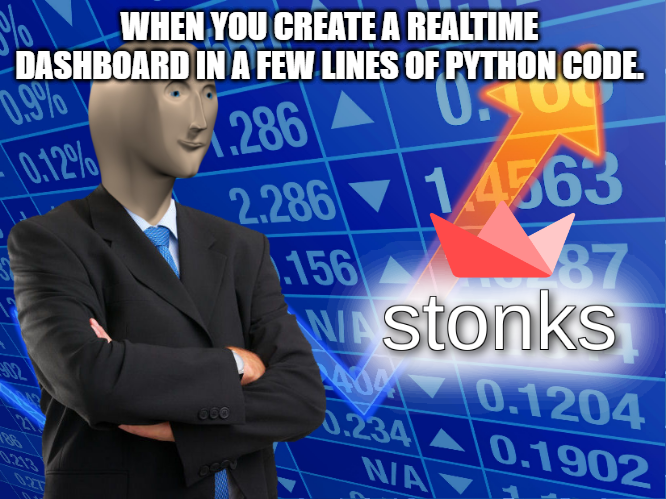

## Streamlit Stream STONKS!



A practical implementation of a realtime stocks dashboard using streamlit stream template.

#### How to run ?

Clone the repo,

1. Get your API key from [Finnhub](https://finnhub.io)
2.a. (Unsafe) Replace ${FINNHUB_TOKEN} in docker-compose.yml with your api 
2.b. Set host machine's env variable FINNHUB_TOKEN=your-token-value
3.  ```docker-compose up```

And you are done.

```You can only have one active websocket connection at a time with free trial of finnhub!```


#### Development

The docker-compose by default mounts the "consumer" directory to "src" inside container to leverage hot-reload of streamlit, so that you dont have to install any dependencies locally ! 😊
